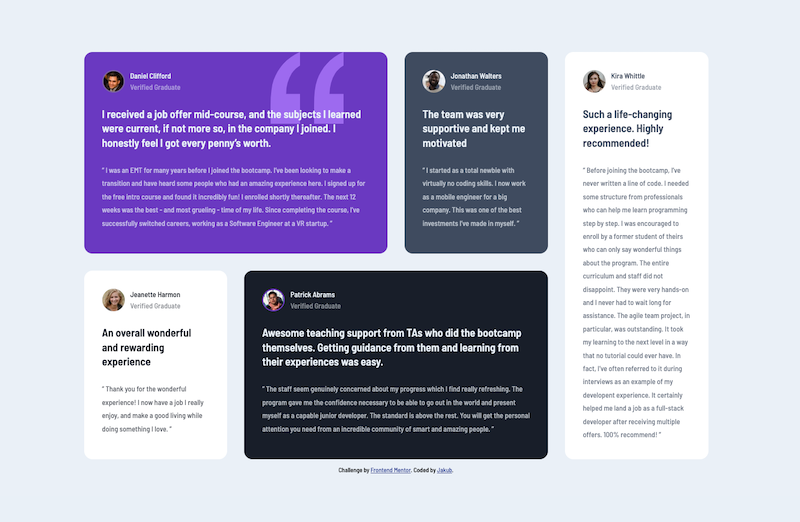
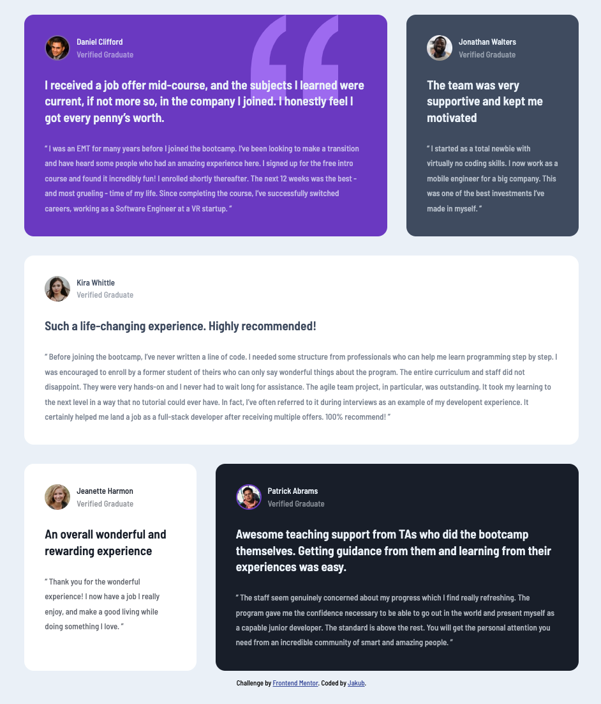

# Frontend Mentor - Testimonials grid section solution

This is my first chalange on Frontend Mentor. This is a solution to the [Testimonials grid section challenge](https://www.frontendmentor.io/challenges/testimonials-grid-section-Nnw6J7Un7).

## Table of contents

- [Overview](#overview)
  - [The challenge](#the-challenge)
  - [Screenshot](#screenshot)
  - [Links](#links)
- [My process](#my-process)
  - [Built with](#built-with)
  - [Purpose of chalange](#Purpose-of-chalange)
- [Author](#author)

## Overview

### The challenge

Users should be able to:

- View the optimal layout for the site depending on their device's screen size

### Screenshot

### Links

- Demo: [https://jakubm-i.github.io/frontendmentor-testimonials-grid-section/](https://jakubm-i.github.io/frontendmentor-testimonials-grid-section/)

## My process

### Built with

- Semantic HTML5 markup
- CSS custom properties
- Flexbox
- CSS Grid
- BEM
- CSS function min, max

### Purpose of chalange

The aim of the challenge was to practise building a layout based on Grid or Flexbox. 

## Author

- GitHub - [JakubM-I](https://github.com/JakubM-I)
- Frontend Mentor - [@JakubM-I](https://www.frontendmentor.io/profile/JakubM-I)
